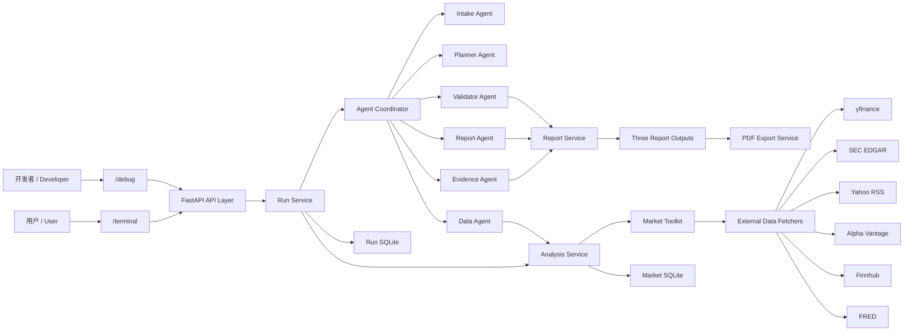
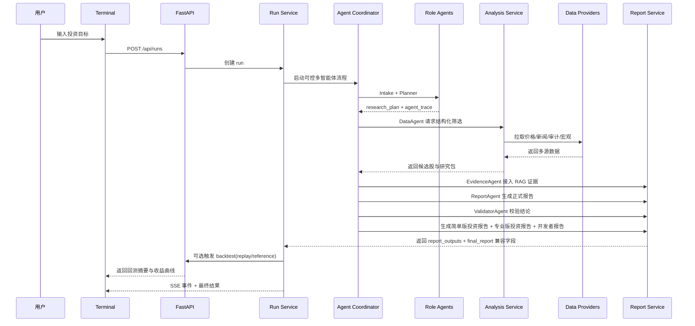

# Financial Agent

Financial Agent 是一个面向美股研究场景的双语投研 Agent。它把用户的自然语言问题，转成可追踪的研究流程：理解需求、筛选股票、收集数据、检索证据、生成简单版投资报告、专业版投资报告和开发者报告、校验结论，并支持回测和真实 PDF 导出。

这个项目定位为正式开源项目：它不是单纯聊天机器人，而是一个带前端产品界面、后端多角色流程、RAG 证据库、回测、审计和部署能力的完整研究系统。

## 快速阅读提示

如果你正在快速了解这个仓库，请优先理解这几件事：

- 项目主题：AI-powered financial research agent for US equities。
- 用户入口：`/terminal`，包含开始研究、研究结论、回测页、历史页。
- 开发者入口：`/debug`，展示 agent trace、阶段、产物和原始 JSON。
- 核心卖点：可控多智能体流程、本地知识库 RAG、结论一致性校验、三报告输出、真实 PDF 报告导出、回测 V2、长期记忆。
- 部署方式：单仓库、单 Docker 服务，适合 Railway 发布。
- 当前定位：研究型正式开源项目，不是投资建议平台，也不是完整生产交易系统。

推荐阅读顺序：

1. `README.md`：项目总览。
2. `docs/architecture.md`：模块职责和调用关系。
3. `CONTEXT.md`：当前开发进度和最近关键决定。
4. `docs/deployment/railway_deploy.md`：Railway 部署说明。

## 项目解决什么问题

普通投资聊天机器人通常只会给观点，但很难说明“为什么这样判断”。这个项目重点解决四个问题：

- 用户目标如何被理解：资金、风险、期限、风格和偏好会被提取并保存。
- 数据从哪里来：价格、新闻、SEC、宏观、评分和缓存都有记录。
- 结论是否可信：报告生成后会检查评分、风险、证据时效和数据降级。
- 结果如何交付：用户可以查看网页报告、回测结果，并下载真正的 PDF。

## 当前主要功能

- 支持中文 / 英文投资需求输入
- 支持自然语言 Agent 研究模式和结构化筛选模式
- 支持可控多智能体投研流程：Intake、Planner、Data、Evidence、Report、Validator 六个角色分工协作
- 支持增强版 `research_plan` 与 `agent_trace`：每次研究都会留下目标、数据需求、降级策略、agent 状态、耗时和证据数量
- 支持 `/terminal` 双模式：实时研究 + 历史回测研究
- 支持首页 `/`：简洁用户入口，直接进入研究终端
- 支持首页“用户信任入口”：一句价值主张、强 CTA、三步上手和三条短可信点
- 支持高强度动效背景（Canvas 粒子 + 流线 + 光晕）与毛玻璃视觉层
- 支持动效开关与低动态自动降级（prefers-reduced-motion）
- 支持品牌化首页：大主视觉、强 CTA、三步上手和动态研究场景
- 支持 `/terminal` 四页化终端：开始研究、研究结论、回测页、历史页独立展示
- 支持终端顶部账户入口：登录、注册、退出和“同步浏览器记忆”都在前台可见
- 支持按浏览器隔离的长期记忆：首次打开自动生成本地 `client_id`，不同浏览器彼此分开
- 支持账户版长期记忆：登录后偏好优先写入账户档案，并可把当前浏览器记忆绑定到账户
- 支持长期偏好自动学习：本次问题里明确写出的资金、风险、期限、风格和偏好行业，会自动写回长期记忆
- 支持少重复追问：后续自然语言研究会优先复用已保存的长期偏好，只补空缺，不覆盖本次明确输入
- 支持结论依据与谨慎提示摘要：不仅给答案，也说明为什么这样判断、哪里需要谨慎
- 支持研究结论页首屏可信度摘要：一眼看到证据条数、最新依据日期、校验状态和回测状态
- 支持本地知识库 RAG：每次研究会把新闻摘要、SEC、评分、宏观和数据来源写入 SQLite 知识库
- 支持结论一致性校验：报告生成后会检查优先标的、评分排序、风险、数据降级、证据时效和时间范围是否一致
- 支持历史审计摘要：历史页可直接看到本次研究用了哪些数据、哪里降级了、最终优先看什么
- 支持更短的澄清追问：当问题关键信息不足时，用一句简短问题继续追问
- 支持“补一句继续研究”：当核心条件不足时，用户可直接补一句信息继续当前任务
- 支持 3 条固定标准示例问题，便于快速进入中文、英文和历史回测场景
- 支持开始研究页的三种起点：单次问题、组合研究、持续跟踪
- 支持开始研究页的结构化补充 chips 和“四步预览”，让用户在提问前就知道系统会如何完成研究
- 支持首次进入终端的成熟产品引导：欢迎弹窗先说明 Financial Agent 能做什么，再用分步浮层指向开始研究、进度、结论、回测、历史和账户入口
- 支持回测 V2：历史建议回放（replay）与历史表现参考（reference），并可配置交易成本、滑点、分红、简化税费和再平衡口径
- 支持生产治理基础能力：`/healthz`、`/readyz`、结构化日志、管理员审计事件和 GitHub Actions CI
- 支持数据刷新任务记录：股票池、宏观和全量刷新可手动触发，并保留最近任务状态
- 支持 Playwright 端到端 smoke test：覆盖 Terminal 四个主路由
- 支持任务进度条与“撤回任务”能力（cancelled 状态）
- 支持按真实阶段推断的任务进度条，不再在报告生成阶段长时间停在固定百分比
- 支持终端顶部重新打开用户引导，完成或跳过后不会反复打扰用户
- 支持“示例报告驱动”的新手引导：首页“看示例”和终端“引导”会先载入前端静态示例报告，再讲解结论页和回测页
- 支持用户前台 `/terminal` 与开发者后台 `/debug`
- 支持 Run / Step / Artifact / Event 级别追踪
- 支持正式研究报告、图表摘要与报告导出，其中简单版投资 PDF 采用更短的平衡版模板，并由后端 Playwright/Chromium 生成真实 `.pdf` 文件
- 支持一次研究生成三份报告：简单版投资报告回答“结论、仓位、风险和怎么执行”，专业版投资报告保留机构研究深度，开发者报告回答“Agent、RAG、校验和回测如何支撑结论”
- 支持多数据源主源 / 备用源 / 本地缓存
- 支持同公司多代码防错（如 GOOG/GOOGL）：默认去重，用户明确点名时保留多类别
- 支持逐票卡片中的可点击新闻链接与 SEC 披露链接
- 支持回测“结果解释卡”和“本次回测口径”，说明为何跑赢或跑输基准，以及收益计算的保守假设
- 支持历史页“一键继续跟进”与本地持续跟踪列表：旧研究可以直接带回提问页，用最新数据续跑

## 技术栈

前端：

- React
- TypeScript
- Vite
- Tailwind CSS
- shadcn/ui
- Playwright E2E

后端：

- Python
- FastAPI
- Pydantic
- Uvicorn
- pandas

### LLM

- DeepSeek Chat Completions
- OpenAI 兼容 HTTP 接口：`https://api.deepseek.com`
- 报告生成统一使用 DeepSeek，避免多供应商口径不一致

## 数据源

### 股票池 / Universe

- Alpaca `/v2/assets`：主股票池来源
- Wikipedia S&P 500：当前可用备用源
- 本地 CSV：最终兜底种子

### 市场与研究数据

- Alpaca Bars（`data.alpaca.markets/v2/stocks/bars`）：价格主源（实时与回测）
- yfinance：价格与技术面第一备用源、宏观代理、公开持仓代理
- SEC EDGAR：公司事实、披露与审计核查
- Yahoo Finance RSS：新闻主源
- Alpha Vantage：价格 / 技术面第二备用源（免费额度受限）
- Finnhub：新闻备用源
- FRED：宏观备用源
- 本地缓存（6小时）：价格链路最后兜底

## 页面说明

### `/`

面向首次访问用户的首页，主要展示：

- 品牌主视觉与一句话价值主张
- 三步上手引导
- 三条极短可信点
- 中英切换
- 动效开关（可手动关闭高强度动画）
- 进入终端与示例入口
- “看示例”会进入 `/terminal?guide=demo`，只展示前端静态示例，不调用模型、不请求外部数据、不写入后端历史
- 动态研究场景（更像产品入口，不再只是跳转页）

### `/terminal`

面向普通用户的研究前台，主要展示：

- 四页化终端结构：
  - `/terminal`：开始研究
  - `/terminal/conclusion`：研究结论
  - `/terminal/backtest`：回测页
  - `/terminal/archive`：历史页
- 第一页只保留提问入口、进度条、撤回任务、示例问题和补一句继续研究
- 第一页新增三种起点：单次问题、组合研究、持续跟踪
- 第一页新增结构化补充 chips，帮助用户快速补齐风险、期限、组合和持续跟踪意图
- 第一页新增“四步预览”，在点击前就告诉用户系统会筛选、取数、校验并生成三份报告
- 高级设置默认折叠（实时 / 历史模式、日期、max results、allocation mode、live data、自定义仓位）
- 首次进入终端会先看到简短欢迎弹窗，点击开始后先载入示例报告，再用清晰聚光浮层说明提问、进度、结论、报告、回测和历史；完成或跳过后不再自动弹出
- 顶部保留“引导 / Guide”按钮，可随时重新查看功能区说明
- 研究完成后自动跳到“研究结论”页
- 结论页首屏摘要（结论、风险一句话、下一步动作、优先标的、匹配度）
- 结论页首屏新增可信度摘要（证据条数、最新依据日期、校验状态、回测状态）与推荐持仓预览
- 结论页保留用户可读的依据摘要与谨慎提示
- 原始投资需求卡片（完整显示本次研究绑定的用户问题）
- 顶部账户入口支持登录、注册、退出和浏览器记忆同步
- 信息不足时的“继续研究”卡片（补一句后直接续跑）
- 更清楚的高对比进度区（当前阶段、进度条、状态说明）
- 进度区按真实阶段给出加权进度，进入“生成正式报告”后会直接显示高位进度，不再像卡死
- 阶段化视觉反馈（排队/运行/完成/失败）
- 三标签研究报告：默认展示简单版投资报告，另有专业版投资报告和开发者报告
- 简单版报告固定突出一句话结论、推荐组合、关键风险、执行建议、关键依据和 3 张核心图表
- 专业版报告保留完整评分、逐票研究、估值、质量成长、场景分析、风险登记、证据附录和方法说明
- 简单版投资 PDF 默认保留 3 张关键图：推荐仓位、候选评分，以及“组合 vs 基准回测 / 风险贡献”二选一
- 独立回测页（组合 vs SPY、单股切换、时间序列表）
- 独立历史页（最近报告、打开报告、打开回测）
- 历史页支持一键继续跟进，并提供轻量持续跟踪列表
- 长期记忆继续在后端保存和自动学习，但不再占用终端前台

### `/debug`

面向开发与调试的工作台，主要展示五个标签页：

- 概览（运行状态、研究模式、as_of_date、warning flags、模型路由）
- 阶段（阶段时间线）
- 智能体（六个 agent 的交接状态、耗时、证据数量、警告和失败原因）
- 产物（中间产物明细）
- 原始 JSON（事件与快照原文）

说明：`/debug` 仍保留，但默认不在 Terminal 顶部导航中展示，普通用户只需要关注前台。

## 发布方式

当前最推荐的发布方式是：

- 用 Railway 按 Docker 单服务部署
- 部署后直接获得一个公网网址
- 别人只需要访问 `/` 或 `/terminal`，不需要分别启动前后端

项目已经内置：

- Docker 构建
- 前端随容器一起打包
- 启动时自动读取 `PORT`
- 健康检查地址：`/healthz`
- 就绪检查地址：`/readyz`

详细步骤见：

- [`docs/deployment/railway_deploy.md`](docs/deployment/railway_deploy.md)
- [`docs/plans/2026-04-22-production-hardening-roadmap.md`](docs/plans/2026-04-22-production-hardening-roadmap.md)

## 目录结构

```text
Financial-agent/
├── app/                     # FastAPI 后端
│   ├── api/                 # API 路由
│   ├── agent_runtime/       # Agent 模型、记忆和运行时
│   ├── analysis_runtime/    # 股票筛选和数据聚合
│   ├── core/                # 配置、认证、应用运行时
│   ├── domain/              # 共享数据模型
│   ├── integrations/        # LLM 客户端
│   ├── repositories/        # SQLite 仓储
│   ├── services/            # 核心业务服务
│   ├── tools/               # 外部数据抓取器
│   └── workflows/           # 工作流编排
├── web/                     # React 前端
│   ├── src/components/      # UI 组件
│   ├── src/hooks/           # 状态管理 hook
│   ├── src/lib/             # API、i18n、格式化、导出
│   ├── src/views/           # 页面入口
│   └── e2e/                 # 浏览器端到端测试
├── data/
│   ├── seed/                # 种子股票池
│   └── runtime/             # 本地数据库和缓存，不提交
├── docs/                    # 部署和开发计划文档
│   ├── architecture.md      # 模块职责和调用关系
│   ├── archive/             # 已归档的旧总结文档
│   ├── deployment/          # Railway 部署说明
│   └── plans/               # 开发路线图和阶段计划
├── scripts/                 # 辅助脚本，例如 PDF 渲染
├── tests/                   # 后端测试
├── tmp/                     # 本地临时产物，已被 Git 忽略
├── Dockerfile               # Railway/Docker 单服务部署
├── main.py                  # 本地启动入口
├── CONTEXT.md               # 当前开发上下文
└── README.md
```

## 系统架构图



## Data Flow



## 回测口径（V1.5）

- `replay`（历史建议回放）：适用于历史模式，按“报告后下一个交易日开盘”买入，回放到今天或指定结束日
- `reference`（历史表现参考）：适用于实时模式，按用户选择的历史起点买入，计算到今天的参考收益
- 默认启用保守口径：交易成本 10 bps，滑点 5 bps
- 分红默认不假装纳入；只有数据源本身提供总回报价格时才视为包含
- 当前默认不再平衡，按买入并持有解释结果
- 回测输出：组合收益、SPY 基准收益、超额收益、最大回撤、逐票贡献、收益曲线

## Run 控制（新增）

- `POST /api/runs/{run_id}/cancel`：撤回正在执行的任务
- run 状态新增：`cancelled`
- SSE 事件新增：`run.cancelled`

## 偏好与历史摘要接口

- `GET /api/v1/profile/preferences`：读取当前浏览器的长期偏好
- `PATCH /api/v1/profile/preferences`：手动更新当前浏览器的长期偏好
- `DELETE /api/v1/profile/preferences`：清空当前浏览器的长期偏好
- `GET /api/v1/runs/history`：读取历史研究列表
- `GET /api/v1/runs/{run_id}/audit-summary`：读取某次研究的简版审计摘要

说明：

- 普通请求会自动带上 `X-Client-Id`
- 后端会按这个浏览器标识隔离长期记忆
- 事件流仍按 `run_id` 跟踪，不额外改 SSE 协议

## 快速开始

### 1. 安装依赖

后端：

```powershell
.\.venv\Scripts\python.exe -m pip install -r requirements.txt
```

安装前端依赖并构建：

```powershell
npm install
npx playwright install chromium
npm run build
```

启动：

```powershell
.\.venv\Scripts\python.exe main.py
```

打开：

- `http://127.0.0.1:8001/`
- `http://127.0.0.1:8001/terminal`
- `http://127.0.0.1:8001/debug`
- `http://127.0.0.1:8001/healthz`

## 环境变量

最少需要配置 LLM key：

```powershell
$env:DEEPSEEK_API_KEY="your-key"
```

常用变量：

| 变量名 | 作用 |
| --- | --- |
| `DEEPSEEK_API_KEY` | DeepSeek API Key |
| `DEEPSEEK_MODEL` | DeepSeek 模型名，默认 `deepseek-chat` |
| `DEEPSEEK_BASE_URL` | DeepSeek 接口地址，默认 `https://api.deepseek.com` |
| `ALPACA_API_KEY_ID` | Alpaca 股票池和行情 key |
| `ALPACA_API_SECRET_KEY` | Alpaca secret |
| `FINNHUB_API_KEY` | Finnhub 新闻备用源 |
| `ALPHA_VANTAGE_API_KEY` | Alpha Vantage 备用源 |
| `FRED_API_KEY` | FRED 宏观备用源 |
| `FINANCIAL_AGENT_DB_PATH` | run 数据库路径 |
| `FINANCIAL_AGENT_MARKET_DB_PATH` | market 数据库路径 |
| `FINANCIAL_AGENT_KNOWLEDGE_DB_PATH` | 本地知识库数据库路径 |
| `FINANCIAL_AGENT_UNIVERSE_CSV` | CSV 种子路径 |

## Railway 部署提醒

- Docker 构建时需要把 `data/seed/sp500_supabase_ready.csv` 一起打进镜像，否则服务启动时会缺少股票池种子文件。
- 项目现在还会在应用目录里保留一份备用种子文件；即使 Railway 误把 `/app/data` 整体覆盖掉，服务也不会因为缺少股票池种子而直接启动失败。
- 如果你在 Railway 上挂持久化卷，请挂到 `/app/data/runtime`，不要直接挂到 `/app/data`，否则会把镜像内自带的 `data/seed` 一起覆盖掉。
- 推荐变量写法：
  - `FINANCIAL_AGENT_DB_PATH=/app/data/runtime/financial_agent_runs.sqlite3`
  - `FINANCIAL_AGENT_MARKET_DB_PATH=/app/data/runtime/financial_agent_market.sqlite3`
  - `FINANCIAL_AGENT_KNOWLEDGE_DB_PATH=/app/data/runtime/financial_agent_knowledge.sqlite3`

## 代理场景配置示例

如果你开了系统代理，建议用 `auto`（默认），并让系统代理自动接管：

```powershell
$env:MARKET_PROXY_MODE="auto"
# 可不填 MARKET_PROXY_URL，系统会尝试读取 HTTP_PROXY / HTTPS_PROXY
```

如果你确认代理可用，想让 yfinance 强制走代理：

```powershell
$env:MARKET_PROXY_MODE="proxy"
$env:MARKET_PROXY_URL="http://127.0.0.1:7890"
```

如果你想先直连，失败后再试一次代理：

```powershell
$env:MARKET_PROXY_MODE="auto"
$env:MARKET_PROXY_URL="http://127.0.0.1:7890"
```

## 测试方法与常用命令

后端语法检查：

```powershell
.\.venv\Scripts\python.exe -m py_compile app\main.py app\agent_runtime\controlled_agents.py app\services\agent_coordinator.py app\services\analysis_service.py app\services\agent_service.py app\services\backtest_service.py app\services\toolkit.py app\tools\fetchers.py
```

单元测试：

```powershell
.\.venv\Scripts\python.exe -m pytest -q
```

前端构建：

```powershell
npm run build
```

浏览器端到端测试：

```powershell
npm run test:e2e
```

PDF 引擎依赖：

```powershell
npx playwright install chromium
```

## 当前状态

已完成：

- 品牌首页和四页终端。
- 可控多角色 agent 流程。
- 本地知识库 RAG。
- 结论一致性校验。
- 账户级长期记忆。
- 回测 V2。
- 后端真实 PDF 导出。
- GitHub Actions CI。
- Railway 单服务部署准备。

仍有限制：

- 当前不是完全自治 agent 辩论系统，而是可控多角色流程。
- RAG 使用本地 SQLite FTS5，不是外部向量数据库。
- 历史新闻和 smart money 仍可能降级。
- 回测已经加入保守口径，但仍不是专业交易系统级别。
- 账户系统是本地邮箱密码，还没有 OAuth 和完整多租户后台。
- 免费数据源可能限流，系统会用备用源和缓存缓解，但不能完全避免。

## 安全说明

- 不要把真实 API key 写进仓库。
- `.env.example` 只能放占位符。
- SQLite 数据库、缓存、导出文件和浏览器测试输出不应提交。
- 这个项目输出的是研究辅助信息，不构成投资建议。

## 搜索记录

- 2026-04-13：本轮是既有功能收尾与整合，没有新增外部方案检索。
- 2026-04-20：检索了 Railway、Render 和 Cloudflare Tunnel 的官方资料。结论：当前项目最适合用 Railway 按 Docker 单服务部署；Cloudflare Quick Tunnel 不适合作为主发布方案，因为不支持 SSE。
- 2026-04-21：本轮按既定开发计划实现本地 SQLite FTS5 知识库 RAG，没有新增外部方案检索。
- 2026-04-21：本轮按既定架构计划实现可控多智能体流程，没有新增外部方案检索。

## 已完成与待办

已完成：
- 品牌首页升级（主视觉、强入口、三步引导、动态研究场景）
- `/terminal` 四页化升级（开始研究、研究结论、回测页、历史页）
- 提问入口前置、结论独立成页、自动跳转与更轻的首屏
- 浏览器级长期记忆（自动学习、后端保存、前台不直接展示）
- 后端持久化偏好（SQLite）与对应读取/更新接口
- 历史审计摘要接口与历史页摘要侧栏
- 结论依据摘要、谨慎提示与更短的澄清追问
- `needs_clarification` 状态下的“补一句继续研究”流程
- 3 条固定标准示例问题（中文稳健型 / 英文成长型 / 历史回测型）
- `/terminal` 双模式：实时研究 + 历史回测研究
- 回测接口与前端联动（replay / reference）
- 静态示例引导（固定 `demo-guide-run`，仅前端展示，不进入后端历史）
- 三报告输出与导出（简单版投资报告 + 专业版投资报告 + 开发者报告，后端真 PDF / HTML / Markdown / JSON）
- `/debug` 保留开发者链路可观测能力
- Docker 单服务部署准备（动态 PORT + `/healthz` + Railway 部署文档）
- 本地知识库 RAG 与报告后结论校验层
- 可控多智能体流程（六个角色 agent、研究计划、agent 交接记录）
- RAG 证据时效 / 来源可靠性标记、增强版结论校验和 debug agent trace 可视化
- 回测 V1.5 保守口径说明（交易成本、滑点、分红、再平衡）

待办：
- 把“需要补充信息”的追问做成更自然的连续研究体验
- 增加更稳定的历史新闻与历史 smart money 可回放数据源
- 增加分红再投资、税务口径等更真实的回测参数
