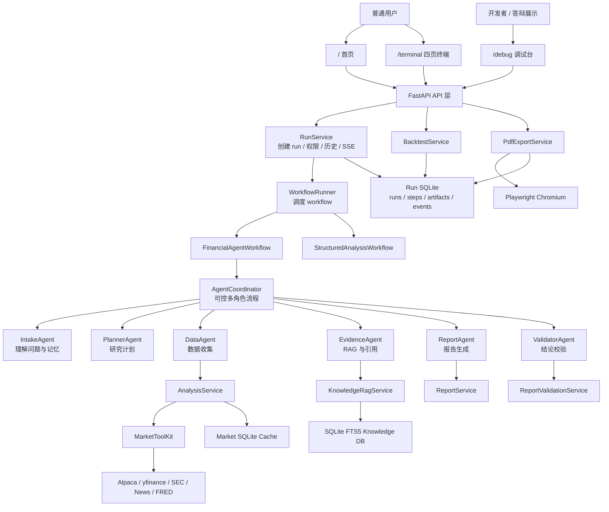
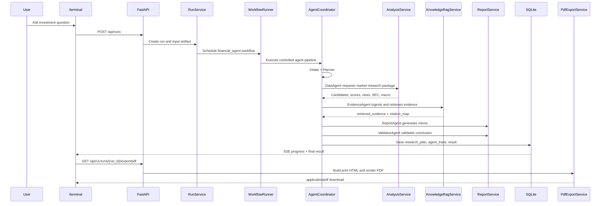

# Financial Agent

Financial Agent 是一个面向美股研究场景的双语投研 Agent。它把用户的自然语言问题，转成可追踪的研究流程：理解需求、筛选股票、收集数据、检索证据、生成报告、校验结论，并支持回测和 PDF 导出。

这个项目适合作为 MSc 展示项目：它不是单纯聊天机器人，而是一个带前端产品界面、后端多角色流程、RAG 证据库、回测和部署能力的完整研究系统。

## 给 ChatGPT 的快速阅读提示

如果你正在用 ChatGPT 帮我做展示 PPT，请优先理解这几件事：

- 项目主题：AI-powered financial research agent for US equities。
- 用户入口：`/terminal`，包含开始研究、研究结论、回测页、历史页。
- 开发者入口：`/debug`，展示 agent trace、阶段、产物和原始 JSON。
- 核心卖点：可控多智能体流程、本地知识库 RAG、结论一致性校验、真实 PDF 报告导出、回测 V2、长期记忆。
- 部署方式：单仓库、单 Docker 服务，适合 Railway 发布。
- 当前定位：研究型可演示系统，不是投资建议平台，也不是完整生产交易系统。

推荐阅读顺序：

1. `README.md`：项目总览和演示口径。
2. `docs/architecture.md`：模块职责和调用关系。
3. `CONTEXT.md`：当前开发进度和最近关键决定。
4. `docs/deployment/railway_deploy.md`：Railway 部署说明。

## 项目解决什么问题

普通投资聊天机器人通常只会给观点，但很难说明“为什么这样判断”。这个项目重点解决四个问题：

- 用户目标如何被理解：资金、风险、期限、风格和偏好会被提取并保存。
- 数据从哪里来：价格、新闻、SEC、宏观、评分和缓存都有记录。
- 结论是否可信：报告生成后会检查评分、风险、证据时效和数据降级。
- 结果如何交付：用户可以查看网页报告、回测结果，并下载真正的 PDF。

## 当前可演示功能

- 双语输入：支持中文和英文投资问题。
- 四页终端：`开始研究`、`研究结论`、`回测页`、`历史页`。
- 可控多智能体流程：Intake、Planner、Data、Evidence、Report、Validator 六个角色。
- Agent Trace：每个角色的状态、耗时、输入摘要、输出摘要、警告和证据数量会被记录。
- 本地知识库 RAG：研究时把新闻摘要、SEC、评分、宏观和数据来源写入 SQLite FTS5。
- 结论校验：检查 top pick、评分排序、风险提示、数据降级和历史时间范围是否一致。
- 回测 V2：支持 replay/reference，包含交易成本、滑点、分红模式、简化税费和再平衡说明。
- 长期记忆：未登录时按浏览器 `client_id` 隔离；登录后支持账户级偏好。
- 真 PDF 导出：后端用 Playwright/Chromium 生成 `.pdf`，不是浏览器打印 HTML。
- 生产基础：`/healthz`、`/readyz`、结构化日志、管理员审计事件和 GitHub Actions CI。

## 演示路线

建议展示时按这个顺序走：

1. 打开首页 `/`，说明这是一个投研 Agent 产品入口。
2. 进入 `/terminal`，输入自然语言投资问题。
3. 展示任务进度条，说明系统正在按阶段完成研究。
4. 自动跳转到 `/terminal/conclusion`，展示结论摘要、证据、评分表、逐票卡和完整 memo。
5. 点击导出 PDF，展示系统生成的正式报告文件。
6. 进入 `/terminal/backtest`，展示组合收益、SPY 对比和回测口径。
7. 进入 `/terminal/archive`，展示历史报告和审计摘要。
8. 最后打开 `/debug`，说明背后有可追踪的 agent trace 和 artifact。

推荐演示问题：

```text
我有 50000 美元，想找适合长期持有的低风险分红股。请优先比较 JNJ、PG、KO，并给我一份正式的投资研究结论，包括估值、ROE、自由现金流、主要风险和执行建议。
```

```text
I have about $50,000 and want long-term growth with controlled risk. Compare Microsoft, Meta and Alphabet, then give me a formal investment memo with valuation, quality, risks and staged entry advice.
```

## 页面说明

### `/`

首页。用于介绍产品、展示视觉入口、语言切换、动效开关和进入终端的 CTA。

### `/terminal`

用户前台。现在拆成四页：

- `/terminal`：开始研究，只保留提问入口、进度和必要操作。
- `/terminal/conclusion`：研究结论，展示摘要、证据、评分表、逐票卡、风险和完整报告。
- `/terminal/backtest`：回测页，展示组合收益、基准对比、逐票贡献和本次回测口径。
- `/terminal/archive`：历史页，查看过去报告并重新打开结论或回测。

### `/debug`

开发者后台。用于展示阶段、agent trace、artifact 和原始 JSON。普通用户前台不会展示这些内部细节。

## 系统架构



## 核心数据流



## 技术栈

前端：

- React
- TypeScript
- Vite
- Tailwind CSS
- shadcn/ui
- Playwright E2E

后端：

- Python
- FastAPI
- Pydantic
- Uvicorn
- pandas

数据与存储：

- SQLite for runs, events, artifacts, backtests, users and audit logs
- SQLite FTS5 for local RAG knowledge base
- Local cache for market data fallback

LLM 与数据源：

- Volcengine Ark as primary LLM provider
- DeepSeek as fallback LLM provider
- Alpaca, yfinance, SEC EDGAR, Yahoo RSS, Alpha Vantage, Finnhub, FRED

PDF：

- Backend Playwright/Chromium renderer
- API endpoint: `GET /api/v1/runs/{run_id}/export/pdf`

## 目录结构

```text
Financial-agent/
├── app/                     # FastAPI 后端
│   ├── api/                 # API 路由
│   ├── agent_runtime/       # Agent 模型、记忆和运行时
│   ├── analysis_runtime/    # 股票筛选和数据聚合
│   ├── core/                # 配置、认证、应用运行时
│   ├── domain/              # 共享数据模型
│   ├── integrations/        # LLM 客户端
│   ├── repositories/        # SQLite 仓储
│   ├── services/            # 核心业务服务
│   ├── tools/               # 外部数据抓取器
│   └── workflows/           # 工作流编排
├── web/                     # React 前端
│   ├── src/components/      # UI 组件
│   ├── src/hooks/           # 状态管理 hook
│   ├── src/lib/             # API、i18n、格式化、导出
│   ├── src/views/           # 页面入口
│   └── e2e/                 # 浏览器端到端测试
├── data/
│   ├── seed/                # 种子股票池
│   └── runtime/             # 本地数据库和缓存，不提交
├── docs/                    # 部署和开发计划文档
│   ├── architecture.md      # 模块职责和调用关系
│   ├── archive/             # 已归档的旧总结文档
│   ├── deployment/          # Railway 部署说明
│   └── plans/               # 开发路线图和阶段计划
├── scripts/                 # 辅助脚本，例如 PDF 渲染
├── tests/                   # 后端测试
├── tmp/                     # 本地临时产物，已被 Git 忽略
├── Dockerfile               # Railway/Docker 单服务部署
├── main.py                  # 本地启动入口
├── CONTEXT.md               # 当前开发上下文
└── README.md
```

## 本地运行

建议使用项目虚拟环境：

```powershell
cd "E:\Msc project\Financial-agent"
.\.venv\Scripts\activate
```

安装后端依赖：

```powershell
.\.venv\Scripts\python.exe -m pip install -r requirements.txt
```

安装前端依赖并构建：

```powershell
npm install
npx playwright install chromium
npm run build
```

启动：

```powershell
.\.venv\Scripts\python.exe main.py
```

打开：

- `http://127.0.0.1:8001/`
- `http://127.0.0.1:8001/terminal`
- `http://127.0.0.1:8001/debug`
- `http://127.0.0.1:8001/healthz`

## 环境变量

最少需要配置 LLM key：

```powershell
$env:ARK_API_KEY="your-key"
```

常用变量：

| 变量名 | 作用 |
| --- | --- |
| `ARK_API_KEY` / `VOLCENGINE_ARK_API_KEY` | 火山 Ark API Key |
| `ARK_MODEL` / `VOLCENGINE_ARK_MODEL` | 火山模型名 |
| `ARK_BASE_URL` / `VOLCENGINE_ARK_BASE_URL` | 火山接口地址 |
| `DEEPSEEK_API_KEY` | DeepSeek 备用模型 API Key |
| `DEEPSEEK_MODEL` | DeepSeek 模型名，默认 `deepseek-chat` |
| `ALPACA_API_KEY_ID` | Alpaca 股票池和行情 key |
| `ALPACA_API_SECRET_KEY` | Alpaca secret |
| `FINNHUB_API_KEY` | Finnhub 新闻备用源 |
| `ALPHA_VANTAGE_API_KEY` | Alpha Vantage 备用源 |
| `FRED_API_KEY` | FRED 宏观备用源 |
| `FINANCIAL_AGENT_DB_PATH` | run 数据库路径 |
| `FINANCIAL_AGENT_MARKET_DB_PATH` | market 数据库路径 |
| `FINANCIAL_AGENT_KNOWLEDGE_DB_PATH` | RAG 知识库路径 |
| `FINANCIAL_AGENT_ENABLE_AUTH` | 是否启用账户登录 |
| `FINANCIAL_AGENT_SESSION_SECRET` | 会话签名密钥 |
| `FINANCIAL_AGENT_PDF_EXPORT_TIMEOUT_SECONDS` | PDF 导出超时时间 |

完整示例见 `.env.example`。

## 部署

推荐部署方式是 Railway + Docker 单服务：

1. 把最新代码推到 GitHub。
2. 在 Railway 选择 `Deploy from GitHub repo`。
3. 让 Railway 使用根目录 `Dockerfile` 构建。
4. 在 Railway 面板配置环境变量。
5. 部署后检查 `/healthz` 和 `/readyz`。

Railway 持久化卷建议挂到：

```text
/app/data/runtime
```

推荐数据库路径：

```text
FINANCIAL_AGENT_DB_PATH=/app/data/runtime/financial_agent_runs.sqlite3
FINANCIAL_AGENT_MARKET_DB_PATH=/app/data/runtime/financial_agent_market.sqlite3
FINANCIAL_AGENT_KNOWLEDGE_DB_PATH=/app/data/runtime/financial_agent_knowledge.sqlite3
```

详细说明见 `docs/deployment/railway_deploy.md`。

## 测试

后端测试：

```powershell
.\.venv\Scripts\python.exe -m pytest -q
```

前端构建：

```powershell
npm run build
```

浏览器端到端测试：

```powershell
npm run test:e2e
```

PDF 引擎依赖：

```powershell
npx playwright install chromium
```

## 当前状态

已完成：

- 品牌首页和四页终端。
- 可控多角色 agent 流程。
- 本地知识库 RAG。
- 结论一致性校验。
- 账户级长期记忆。
- 回测 V2。
- 后端真实 PDF 导出。
- GitHub Actions CI。
- Railway 单服务部署准备。

仍有限制：

- 当前不是完全自治 agent 辩论系统，而是可控多角色流程。
- RAG 使用本地 SQLite FTS5，不是外部向量数据库。
- 历史新闻和 smart money 仍可能降级。
- 回测已经加入保守口径，但仍不是专业交易系统级别。
- 账户系统是本地邮箱密码，还没有 OAuth 和完整多租户后台。
- 免费数据源可能限流，系统会用备用源和缓存缓解，但不能完全避免。

## 安全说明

- 不要把真实 API key 写进仓库。
- `.env.example` 只能放占位符。
- SQLite 数据库、缓存、导出文件和浏览器测试输出不应提交。
- 这个项目输出的是研究辅助信息，不构成投资建议。

## 搜索记录

- 2026-04-13：本轮是既有功能收尾与整合，没有新增外部方案检索。
- 2026-04-20：检索了 Railway、Render 和 Cloudflare Tunnel 的官方资料。结论：当前项目最适合用 Railway 按 Docker 单服务部署；Cloudflare Quick Tunnel 不适合作为主展示方案，因为不支持 SSE。
- 2026-04-21：本轮按既定开发计划实现本地 SQLite FTS5 知识库 RAG，没有新增外部方案检索。
- 2026-04-21：本轮按既定架构计划实现可控多智能体流程，没有新增外部方案检索。
