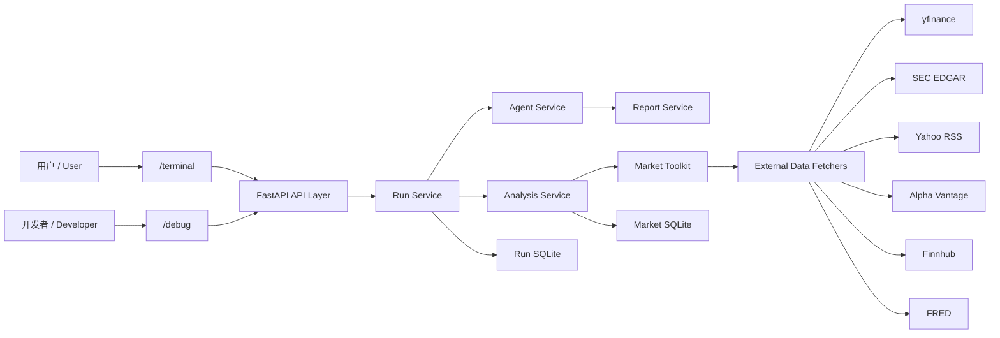
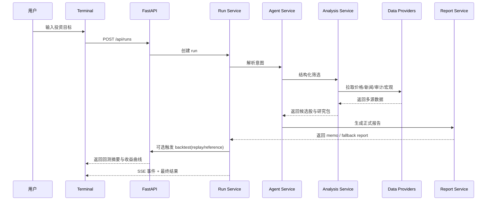

# Financial Agent

面向美股研究场景的双语 Financial Research Agent。  
它把“用户自然语言需求 -> 股票筛选 -> 多源数据聚合 -> 风险校验 -> 投资报告输出”串成一条完整链路，同时保留开发者调试视图，方便继续迭代。

## 这个项目解决什么问题

普通投资类聊天机器人往往只会“说观点”，但很难回答下面这些更接近真实投研的问题：

- 用户的投资目标到底是什么
- 系统是按什么规则筛出候选股的
- 数据来自哪里，哪些是实时的，哪些是缓存的
- 如果外部数据源限流了，系统还能不能继续工作
- 最终给出的建议能不能导出成正式研究报告

这个项目的目标，就是把这些问题做成一个可运行、可解释、可扩展的 Agent 系统。

## 核心能力

- 支持中文 / 英文投资需求输入
- 支持自然语言 Agent 研究模式和结构化筛选模式
- 支持 `/terminal` 双模式：实时研究 + 历史回测研究
- 支持首页 `/`：先看项目介绍与新手引导，再进入研究终端
- 支持高强度动效背景（Canvas 粒子 + 流线 + 光晕）与毛玻璃视觉层
- 支持动效开关与低动态自动降级（prefers-reduced-motion）
- 支持品牌化首页：大主视觉、强 CTA、三步上手和动态研究场景
- 支持 `/terminal` 三页化终端：结论页、回测页、历史页独立展示
- 支持按浏览器隔离的长期记忆：首次打开自动生成本地 `client_id`，不同浏览器彼此分开
- 支持长期偏好自动学习：本次问题里明确写出的资金、风险、期限、风格和偏好行业，会自动写回长期记忆
- 支持结果页直接编辑长期记忆：可保存、恢复当前值、清空记忆
- 支持少重复追问：后续自然语言研究会优先复用已保存的长期偏好，只补空缺，不覆盖本次明确输入
- 支持用户画像摘要：把系统理解到的资金、风险、期限、风格和关注标的前台化展示
- 支持结论依据、校验摘要与安全摘要：不仅给答案，也说明为什么这样判断、哪里需要谨慎
- 支持历史审计摘要：历史页可直接看到本次研究用了哪些数据、哪里降级了、最终优先看什么
- 支持结论页“可信度概览”：第一屏直接展示系统理解、依据摘要、谨慎提示和数据覆盖
- 支持更短的澄清追问：当问题关键信息不足时，用一句简短问题继续追问
- 支持“补一句继续研究”：当核心条件不足时，用户可直接补一句信息继续当前任务
- 支持 3 条固定标准演示问题，便于稳定演示中文、英文和历史回测场景
- 支持回测 V1：历史建议回放（replay）与历史表现参考（reference）
- 支持任务进度条与“撤回任务”能力（cancelled 状态）
- 支持 Terminal 首次进入 3 步新手引导（可跳过并本地记忆）
- 支持用户前台 `/terminal` 与开发者后台 `/debug`
- 支持 Run / Step / Artifact / Event 级别追踪
- 支持正式研究报告、图表摘要与报告导出
- 支持多数据源主源 / 备用源 / 本地缓存
- 支持同公司多代码防错（如 GOOG/GOOGL）：默认去重，用户明确点名时保留多类别
- 支持逐票卡片中的可点击新闻链接与 SEC 披露链接
- 支持回测“结果解释卡”，说明为何跑赢或跑输基准

## 计划文档入口（2026-04-18）

- 周末冲刺计划（48小时）：[`docs/plans/weekend_terminal_sprint_plan.md`](docs/plans/weekend_terminal_sprint_plan.md)
- 周末冲刺计划 PDF：[`docs/plans/weekend_terminal_sprint_plan.pdf`](docs/plans/weekend_terminal_sprint_plan.pdf)
- 10周成熟化路线图：[`docs/plans/10week_mature_agent_roadmap.md`](docs/plans/10week_mature_agent_roadmap.md)
- 10周成熟化路线图 PDF：[`docs/plans/10week_mature_agent_roadmap.pdf`](docs/plans/10week_mature_agent_roadmap.pdf)

## 技术栈

### 前端

- React
- TypeScript
- Vite
- Tailwind CSS v4
- shadcn/ui（核心交互组件）
- 原生 CSS（主题与布局补充）

### 后端

- Python
- FastAPI
- Pydantic
- Uvicorn

### 数据与存储

- SQLite
- pandas

### LLM

- 火山引擎 Ark Python SDK
- 默认走 Coding Plan 路线：`/api/coding/v3`

## 数据源

### 股票池 / Universe

- Alpaca `/v2/assets`：主股票池来源
- Wikipedia S&P 500：当前可用备用源
- 本地 CSV：最终兜底种子

### 市场与研究数据

- Alpaca Bars（`data.alpaca.markets/v2/stocks/bars`）：价格主源（实时与回测）
- yfinance：价格与技术面第一备用源、宏观代理、公开持仓代理
- SEC EDGAR：公司事实、披露与审计核查
- Yahoo Finance RSS：新闻主源
- Alpha Vantage：价格 / 技术面第二备用源（免费额度受限）
- Finnhub：新闻备用源
- FRED：宏观备用源
- 本地缓存（6小时）：价格链路最后兜底

## 页面说明

### `/`

面向演示和首次访问用户的首页，主要展示：

- 品牌主视觉与产品价值
- 三步上手引导
- 中英切换
- 动效开关（可手动关闭高强度动画）
- 进入终端与示例入口
- 动态研究场景（更像产品入口，不再只是跳转页）

### `/terminal`

面向普通用户的研究前台，主要展示：

- 三页化终端结构：
  - `/terminal`：结论页
  - `/terminal/backtest`：回测页
  - `/terminal/archive`：历史页
- 结论页首屏摘要（结论、风险一句话、下一步动作、优先标的、匹配度）
- 结论页可信度概览（系统理解、依据、谨慎提示、记忆与数据覆盖）
- 长期记忆卡片（查看和编辑当前浏览器保存的资金、风险、期限、风格、板块、行业）
- 本次自动沿用提示（显示这次研究从长期记忆里补了哪些字段）
- 本次写回记忆提示（显示这次又新学到了哪些长期偏好）
- 用户画像摘要（系统理解到的资金、风险、期限、风格、关注标的）
- 结论依据、校验摘要与安全摘要
- 原始投资需求卡片（完整显示本次研究绑定的用户问题）
- 信息不足时的“继续研究”卡片（补一句后直接续跑）
- 更清楚的高对比进度区（当前阶段、进度条、状态说明）
- 阶段化视觉反馈（排队/运行/完成/失败）
- 实时模式 / 历史回测模式切换
- 市场概览
- 投资目标输入
- 正式研究报告（含图表与执行建议）
- 独立回测页（组合 vs SPY、单股切换、时间序列表）
- 独立历史页（最近报告、打开报告、打开回测）
- 简版数据依据（仅来源、覆盖、刷新时间和告警摘要）

### `/debug`

面向开发与调试的工作台，主要展示四个标签页：

- 概览（运行状态、研究模式、as_of_date、warning flags、模型路由）
- 阶段（阶段时间线）
- 产物（中间产物明细）
- 原始 JSON（事件与快照原文）

说明：`/debug` 仍保留，但默认不在 Terminal 顶部导航中展示，演示时聚焦用户前台。

## 对外展示方式

当前最推荐的展示方式是：

- 用 Railway 按 Docker 单服务部署
- 部署后直接获得一个公网网址
- 别人只需要访问 `/` 或 `/terminal`，不需要分别启动前后端

项目已经内置：

- Docker 构建
- 前端随容器一起打包
- 启动时自动读取 `PORT`
- 健康检查地址：`/healthz`

详细步骤见：

- [`docs/deployment/railway_deploy.md`](docs/deployment/railway_deploy.md)

## 目录结构

```text
Financial-agent/
├── app/                     # 正式后端代码
│   ├── api/                 # FastAPI 路由
│   ├── agent_runtime/       # 自然语言 Agent 运行时
│   ├── analysis_runtime/    # 结构化筛选与实时数据聚合
│   ├── common/              # 通用 payload / executor
│   ├── core/                # 配置、认证、运行时装配
│   ├── domain/              # 共享契约与数据模型
│   ├── integrations/        # 第三方集成，例如 LLM client
│   ├── repositories/        # SQLite 仓储
│   ├── services/            # 核心业务服务
│   ├── tools/               # 外部数据抓取器
│   └── workflows/           # 工作流编排
├── web/                     # 正式前端代码
│   ├── src/components/      # 页面组件
│   ├── src/hooks/           # 状态与数据 hook
│   ├── src/lib/             # API、i18n、格式化、导出
│   └── src/views/           # /terminal 与 /debug 入口页面
├── data/
│   ├── seed/                # 种子数据
│   └── runtime/             # SQLite 与运行期缓存（已忽略）
├── legacy/                  # 历史兼容代码与旧静态资源
├── tests/                   # 单元测试
├── scripts/                 # 启动或辅助脚本
├── main.py                  # 根入口，兼容 `python main.py`
└── README.md
```

## 系统架构图



## Data Flow



## 回测口径（V1）

- `replay`（历史建议回放）：适用于历史模式，按“报告后下一个交易日开盘”买入，回放到今天或指定结束日
- `reference`（历史表现参考）：适用于实时模式，按用户选择的历史起点买入，计算到今天的参考收益
- 回测输出：组合收益、SPY 基准收益、超额收益、最大回撤、逐票贡献、收益曲线

## Run 控制（新增）

- `POST /api/runs/{run_id}/cancel`：撤回正在执行的任务
- run 状态新增：`cancelled`
- SSE 事件新增：`run.cancelled`

## 偏好与历史摘要接口

- `GET /api/v1/profile/preferences`：读取当前浏览器的长期偏好
- `PATCH /api/v1/profile/preferences`：手动更新当前浏览器的长期偏好
- `DELETE /api/v1/profile/preferences`：清空当前浏览器的长期偏好
- `GET /api/v1/runs/history`：读取历史研究列表
- `GET /api/v1/runs/{run_id}/audit-summary`：读取某次研究的简版审计摘要

说明：

- 普通请求会自动带上 `X-Client-Id`
- 后端会按这个浏览器标识隔离长期记忆
- 事件流仍按 `run_id` 跟踪，不额外改 SSE 协议

## 快速开始

### 1. 安装依赖

后端：

```powershell
python -m pip install -r requirements.txt
```

前端：

```powershell
npm install
```

### 2. 配置环境变量

系统会在启动时自动读取项目根目录的 `.env` 文件，也支持直接使用系统环境变量。

最少需要设置火山 API Key：

```powershell
$env:ARK_API_KEY="your-key"
```

如果你还想启用备用数据源，可以继续设置：

```powershell
$env:ALPHA_VANTAGE_API_KEY="your-alpha-key"
$env:FINNHUB_API_KEY="your-finnhub-key"
$env:FRED_API_KEY="your-fred-key"
```

### 3. 启动项目

```powershell
python main.py
```

然后打开：

- `http://127.0.0.1:8001/`
- `http://127.0.0.1:8001/terminal`
- `http://127.0.0.1:8001/terminal/backtest`
- `http://127.0.0.1:8001/terminal/archive`
- `http://127.0.0.1:8001/debug`
- `http://127.0.0.1:8001/healthz`

## 部署方法与命令

### Docker 本地启动

```powershell
docker compose up --build
```

启动后默认访问：

- `http://127.0.0.1:8001/`
- `http://127.0.0.1:8001/healthz`

### Railway 公网部署

推荐做法：

1. 把最新代码推到 GitHub
2. 在 Railway 连接这个仓库
3. 让 Railway 按根目录 `Dockerfile` 构建
4. 在 Railway 面板填写环境变量
5. 首次部署后先检查 `/healthz`

详细步骤见：

- [`docs/deployment/railway_deploy.md`](docs/deployment/railway_deploy.md)

## 环境变量说明

| 变量名 | 作用 |
| --- | --- |
| `ARK_API_KEY` / `VOLCENGINE_ARK_API_KEY` | 火山 Ark API Key |
| `ARK_MODEL` / `VOLCENGINE_ARK_MODEL` | 模型名 |
| `ARK_BASE_URL` / `VOLCENGINE_ARK_BASE_URL` | 模型路由地址 |
| `ALPHA_VANTAGE_API_KEY` | Alpha Vantage 备用源 |
| `FINNHUB_API_KEY` | Finnhub 备用源 |
| `FRED_API_KEY` | FRED 备用源 |
| `MARKET_PROXY_MODE` | yfinance 路由模式：`direct` / `proxy` / `auto` |
| `MARKET_PROXY_URL` | `proxy/auto` 模式下 yfinance 使用的代理地址（为空时自动尝试系统代理） |
| `MARKET_NO_PROXY_HOSTS` | yfinance 直连时强制绕过代理的域名列表 |
| `ALPACA_API_KEY_ID` | Alpaca 股票池主源 |
| `ALPACA_API_SECRET_KEY` | Alpaca Secret |
| `FINANCIAL_AGENT_DB_PATH` | run 数据库路径 |
| `FINANCIAL_AGENT_MARKET_DB_PATH` | market 数据库路径 |
| `FINANCIAL_AGENT_UNIVERSE_CSV` | CSV 种子路径 |

## Railway 部署提醒

- Docker 构建时需要把 `data/seed/sp500_supabase_ready.csv` 一起打进镜像，否则服务启动时会缺少股票池种子文件。
- 项目现在还会在应用目录里保留一份备用种子文件；即使 Railway 误把 `/app/data` 整体覆盖掉，服务也不会因为缺少股票池种子而直接启动失败。
- 如果你在 Railway 上挂持久化卷，请挂到 `/app/data/runtime`，不要直接挂到 `/app/data`，否则会把镜像内自带的 `data/seed` 一起覆盖掉。
- 推荐变量写法：
  - `FINANCIAL_AGENT_DB_PATH=/app/data/runtime/financial_agent_runs.sqlite3`
  - `FINANCIAL_AGENT_MARKET_DB_PATH=/app/data/runtime/financial_agent_market.sqlite3`

## 代理场景配置示例

如果你开了系统代理，建议用 `auto`（默认），并让系统代理自动接管：

```powershell
$env:MARKET_PROXY_MODE="auto"
# 可不填 MARKET_PROXY_URL，系统会尝试读取 HTTP_PROXY / HTTPS_PROXY
```

如果你确认代理可用，想让 yfinance 强制走代理：

```powershell
$env:MARKET_PROXY_MODE="proxy"
$env:MARKET_PROXY_URL="http://127.0.0.1:7890"
```

如果你想先直连，失败后再试一次代理：

```powershell
$env:MARKET_PROXY_MODE="auto"
$env:MARKET_PROXY_URL="http://127.0.0.1:7890"
```

## 测试方法与常用命令

后端语法检查：

```powershell
.\.venv\Scripts\python.exe -m py_compile app\main.py app\services\analysis_service.py app\services\agent_service.py app\services\backtest_service.py app\services\toolkit.py app\tools\fetchers.py
```

单元测试：

```powershell
.\.venv\Scripts\python.exe -m pytest -q
```

前端构建：

```powershell
npm run build
```

## 安全说明

- private 仓库不等于安全仓库
- 任何进入 git 历史的密钥，都应视为已泄露
- `.env.example` 只能保留占位符，不能保留真实值
- SQLite、导出文件、浏览器自动化快照都不应该提交到仓库

## 当前局限

- 当前“依据检索”仍是基于结构化研究结果的轻量版本，还不是完整知识库式 RAG
- 长期记忆当前按浏览器隔离，还不是跨设备同步的正式账户体系
- Smart Money 目前仍然是公开持仓代理，不是真正的机构级资金流
- 免费数据源容易遇到限流，系统目前通过备用源与本地缓存缓解，但无法完全避免
- Alpaca 全美股票池已接好结构，但需要用户自行配置 key / secret
- 当前仍是单仓库、单服务架构，适合研究型项目，不是完整生产平台

## 路线图

- 完善 Alpaca 股票池同步与本地 `security_master`
- 继续补强 Smart Money 的低频备用链
- 继续优化 `/terminal` 的产品表达与可视化
- 补更多自动化刷新与数据更新任务

## 搜索记录

- 2026-04-13：本轮是既有功能收尾与整合，没有新增外部方案检索。
- 2026-04-20：检索了 Railway、Render 和 Cloudflare Tunnel 的官方资料。结论：当前项目最适合用 Railway 按 Docker 单服务部署；Cloudflare Quick Tunnel 不适合作为主展示方案，因为不支持 SSE。

## 已完成与待办

已完成：
- 品牌首页升级（主视觉、强入口、三步引导、动态研究场景）
- `/terminal` 三页化升级（结论页、回测页、历史页）
- 轻量记忆、用户画像、结论依据、校验摘要与安全摘要
- 浏览器级长期记忆（自动学习、前台可编辑、可清空）
- 后端持久化偏好（SQLite）与对应读取/更新接口
- 历史审计摘要接口与历史页摘要侧栏
- 结论页可信度概览与更短的澄清追问
- `needs_clarification` 状态下的“补一句继续研究”流程
- 3 条固定标准演示问题（中文稳健型 / 英文成长型 / 历史回测型）
- `/terminal` 双模式：实时研究 + 历史回测研究
- 回测接口与前端联动（replay / reference）
- 报告区图表化与导出（PDF/HTML/Markdown/JSON）
- `/debug` 保留开发者链路可观测能力
- Docker 单服务部署准备（动态 PORT + `/healthz` + Railway 部署文档）

待办：
- 补更正式的知识检索层（RAG）与更强的结论校验层
- 把“需要补充信息”的追问做成更自然的连续研究体验
- 增加更稳定的历史新闻与历史 smart money 可回放数据源
- 增加交易成本、分红再投资、税务口径等更真实的回测参数
