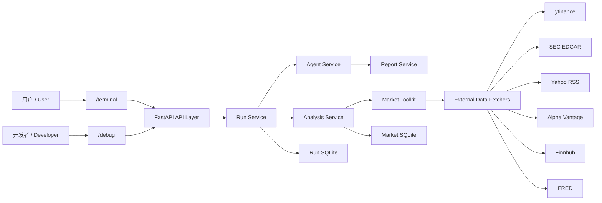
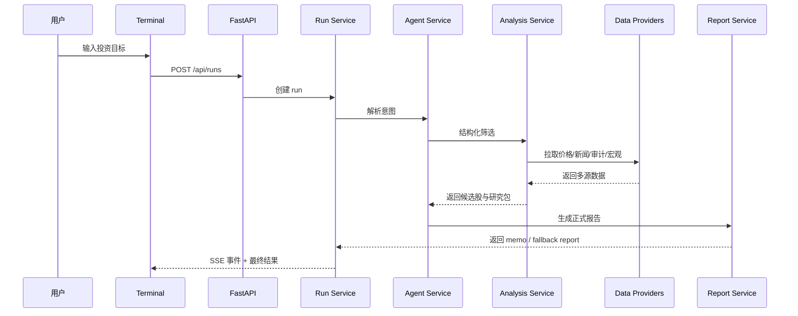

# Financial Agent

面向美股研究场景的双语 Financial Research Agent。  
它把“用户自然语言需求 -> 股票筛选 -> 多源数据聚合 -> 风险校验 -> 投资报告输出”串成一条完整链路，同时保留开发者调试视图，方便继续迭代。

## 这个项目解决什么问题

普通投资类聊天机器人往往只会“说观点”，但很难回答下面这些更接近真实投研的问题：

- 用户的投资目标到底是什么
- 系统是按什么规则筛出候选股的
- 数据来自哪里，哪些是实时的，哪些是缓存的
- 如果外部数据源限流了，系统还能不能继续工作
- 最终给出的建议能不能导出成正式研究报告

这个项目的目标，就是把这些问题做成一个可运行、可解释、可扩展的 Agent 系统。

## 核心能力

- 支持中文 / 英文投资需求输入
- 支持自然语言 Agent 研究模式和结构化筛选模式
- 支持用户前台 `/terminal` 与开发者后台 `/debug`
- 支持 Run / Step / Artifact / Event 级别追踪
- 支持正式研究报告、图表摘要与报告导出
- 支持多数据源主源 / 备用源 / 本地缓存

## 技术栈

### 前端

- React
- TypeScript
- Vite
- 原生 CSS

### 后端

- Python
- FastAPI
- Pydantic
- Uvicorn

### 数据与存储

- SQLite
- pandas

### LLM

- 火山引擎 Ark Python SDK
- 默认走 Coding Plan 路线：`/api/coding/v3`

## 数据源

### 股票池 / Universe

- Alpaca `/v2/assets`：计划中的主股票池来源
- Wikipedia S&P 500：当前可用备用源
- 本地 CSV：最终兜底种子

### 市场与研究数据

- yfinance：价格、技术指标、宏观代理、公开持仓代理
- SEC EDGAR：公司事实、披露与审计核查
- Yahoo Finance RSS：新闻主源
- Alpha Vantage：价格 / 技术面备用源
- Finnhub：新闻备用源
- FRED：宏观备用源

## 页面说明

### `/terminal`

面向普通用户的研究前台，主要展示：

- 市场概览
- 投资目标输入
- 本次建议
- 正式研究报告
- 历史报告
- 数据依据

### `/debug`

面向开发与调试的工作台，主要展示：

- 运行状态
- 阶段时间线
- 中间产物
- 原始 JSON 快照

## 目录结构

```text
Financial-agent/
├── app/                     # 正式后端代码
│   ├── api/                 # FastAPI 路由
│   ├── agent_runtime/       # 自然语言 Agent 运行时
│   ├── analysis_runtime/    # 结构化筛选与实时数据聚合
│   ├── common/              # 通用 payload / executor
│   ├── core/                # 配置、认证、运行时装配
│   ├── domain/              # 共享契约与数据模型
│   ├── integrations/        # 第三方集成，例如 LLM client
│   ├── repositories/        # SQLite 仓储
│   ├── services/            # 核心业务服务
│   ├── tools/               # 外部数据抓取器
│   └── workflows/           # 工作流编排
├── web/                     # 正式前端代码
│   ├── src/components/      # 页面组件
│   ├── src/hooks/           # 状态与数据 hook
│   ├── src/lib/             # API、i18n、格式化、导出
│   └── src/views/           # /terminal 与 /debug 入口页面
├── data/
│   ├── seed/                # 种子数据
│   └── runtime/             # SQLite 与运行期缓存（已忽略）
├── legacy/                  # 历史兼容代码与旧静态资源
├── tests/                   # 单元测试
├── scripts/                 # 启动或辅助脚本
├── main.py                  # 根入口，兼容 `python main.py`
└── README.md
```

## 系统架构图



## Data Flow



## 快速开始

### 1. 安装依赖

后端：

```powershell
python -m pip install -r requirements.txt
```

前端：

```powershell
npm install
```

### 2. 配置环境变量

最少需要设置火山 API Key：

```powershell
$env:ARK_API_KEY="your-key"
```

如果你还想启用备用数据源，可以继续设置：

```powershell
$env:ALPHA_VANTAGE_API_KEY="your-alpha-key"
$env:FINNHUB_API_KEY="your-finnhub-key"
$env:FRED_API_KEY="your-fred-key"
```

### 3. 启动项目

```powershell
python main.py
```

然后打开：

- `http://127.0.0.1:8001/terminal`
- `http://127.0.0.1:8001/debug`

## 环境变量说明

| 变量名 | 作用 |
| --- | --- |
| `ARK_API_KEY` / `VOLCENGINE_ARK_API_KEY` | 火山 Ark API Key |
| `ARK_MODEL` / `VOLCENGINE_ARK_MODEL` | 模型名 |
| `ARK_BASE_URL` / `VOLCENGINE_ARK_BASE_URL` | 模型路由地址 |
| `ALPHA_VANTAGE_API_KEY` | Alpha Vantage 备用源 |
| `FINNHUB_API_KEY` | Finnhub 备用源 |
| `FRED_API_KEY` | FRED 备用源 |
| `ALPACA_API_KEY_ID` | Alpaca 股票池主源 |
| `ALPACA_API_SECRET_KEY` | Alpaca Secret |
| `FINANCIAL_AGENT_DB_PATH` | run 数据库路径 |
| `FINANCIAL_AGENT_MARKET_DB_PATH` | market 数据库路径 |
| `FINANCIAL_AGENT_UNIVERSE_CSV` | CSV 种子路径 |

## 安全说明

- private 仓库不等于安全仓库
- 任何进入 git 历史的密钥，都应视为已泄露
- `.env.example` 只能保留占位符，不能保留真实值
- SQLite、导出文件、浏览器自动化快照都不应该提交到仓库

## 当前局限

- Smart Money 目前仍然是公开持仓代理，不是真正的机构级资金流
- 免费数据源容易遇到限流，系统目前通过备用源与本地缓存缓解，但无法完全避免
- Alpaca 全美股票池已接好结构，但需要用户自行配置 key / secret
- 当前仍是单仓库、单服务架构，适合研究型项目，不是完整生产平台

## 路线图

- 完善 Alpaca 股票池同步与本地 `security_master`
- 继续补强 Smart Money 的低频备用链
- 让 `/terminal` 更像真实金融研究产品，而不是工程工作台
- 补更多自动化刷新与数据更新任务
