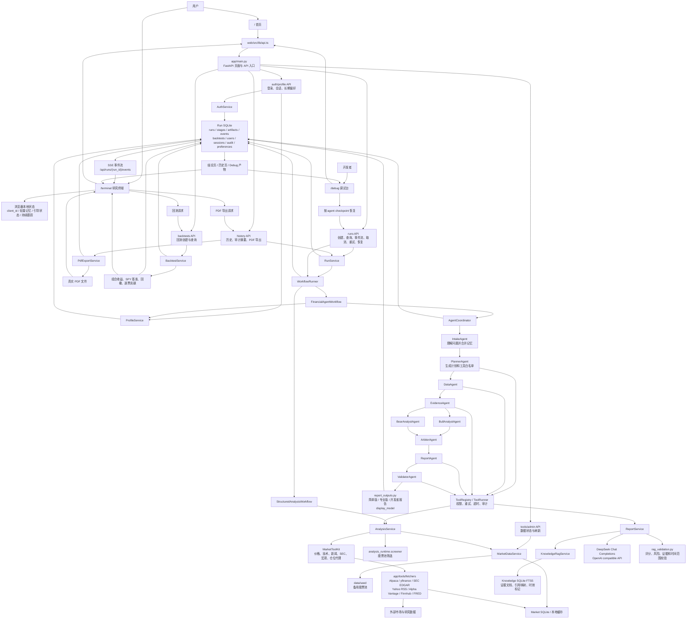
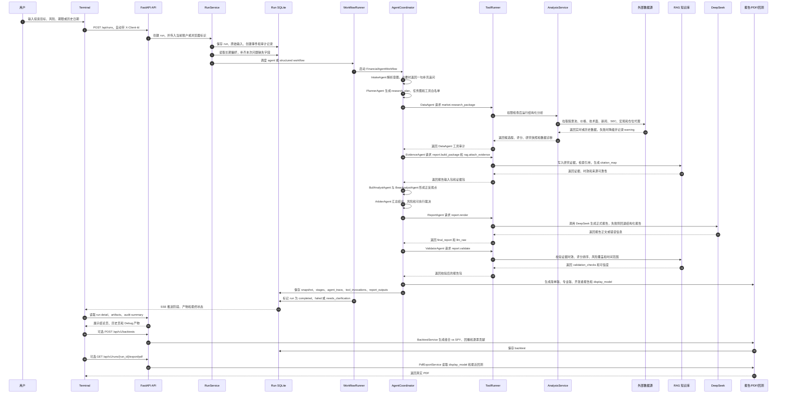

# Data Flow

本文按当前项目结构重新整理 Financial Agent 的完整数据流。README 里保留简版图，这里保留更完整的 GitHub Mermaid 图，方便后续评审、演示和排查。

## 总览图

## 一次自然语言研究的顺序

## 关键数据落点

| 数据 | 产生位置 | 保存或使用位置 |
| --- | --- | --- |
| 用户问题、风险、期限、历史日期 | `/terminal` 表单 | `RunCreateRequest`、run input artifact |
| 浏览器身份 | `web/src/lib/clientIdentity.ts` | 请求头 `X-Client-Id`，用于隔离长期偏好 |
| 账户与会话 | `app/api/auth.py`、`AuthService` | Run SQLite 的用户、会话和审计表 |
| 长期偏好 | `ProfileService`、`AgentMemoryContext` | Run SQLite 的偏好表，下一次研究只补缺失字段 |
| 运行阶段 | `WorkflowContext.add_stage` | Run SQLite 的 stage/event，前端通过 SSE 和详情接口读取 |
| agent 交接记录 | `AgentCoordinator` | `agent_trace`、`agent_checkpoints` artifact，Debug 页面读取 |
| 工具调用审计 | `ToolRunner` | `tool_invocations` artifact，记录权限、耗时、重试和错误 |
| 市场数据 | `MarketToolKit`、fetchers | 研究快照、Market SQLite、本地缓存 |
| RAG 证据 | `KnowledgeRagService` | Knowledge SQLite FTS5、citation map、报告引用 |
| 报告输出 | `report_outputs.py` | 简单版、专业版、开发者报告和 PDF 共用的 `display_model` |
| 回测结果 | `BacktestService` | Run SQLite 的 backtest 记录，结论页和回测页读取 |
| PDF 文件 | `PdfExportService` | 即时生成并返回，不作为运行主结果写回 |

## 旁路流程

- 示例引导走 `web/src/lib/demoResearch.ts`，只在前端注入固定示例，不创建真实 run，不写入后端历史。
- 结构化模式走 `StructuredAnalysisWorkflow`，直接进入 `AnalysisService`，不经过九个 agent。
- `/debug` 可从某个可恢复 agent 的 checkpoint 开始重跑，系统会复用上游结果并重跑该 agent 及下游。
- 历史页优先读取审计摘要，不直接消费完整 run 原始结果，避免前台展示过重。
